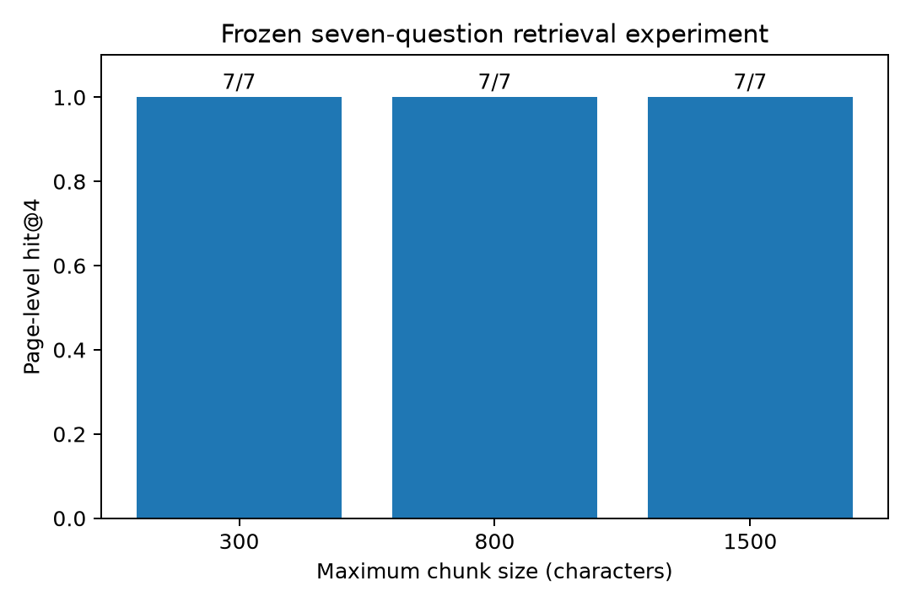

# Measured results and failure analysis

The first frozen run is stored in `evals/results/run-01/`. The source is the January 2024 OSHA/NIOSH Small Business Safety and Health Handbook, downloaded from the [CDC permanent archive](https://stacks.cdc.gov/view/cdc/148137). The PDF itself remains outside Git. The source hash and ten questions were committed before model runs.

## Reproduction details

- Hardware: Apple M5 Pro, 24 GB memory; macOS, Ollama 0.34.1, Python 3.12.14, Tesseract 5.5.3 (English).
- Answer model: qwen3:8b, Q4_K_M, digest `500a1f067a9f782620b40bee6f7b0c89e17ae61f686b92c24933e4ca4b2b8b41`.
- Embedding model: qwen3-embedding:0.6b, 1024 dimensions, digest `ac6da0dfba84a81fdbfbaf330198c33cd77c4cdfc53e8bc50eb581914a15621d`.
- Answer settings: temperature 0, seed 42, context 8192, maximum generated tokens 1200, thinking disabled. Prompt version grounded-v1.
- All runs: automatic OCR, 300 DPI for sparse pages, fixed 60-character overlap, page-bounded splitting, normalized inner-product FAISS search, top four passages.
- Grader: Codex, using manual inspection of each generated answer against expected facts and the actual cited retrieved passages. A second coding agent reviewed the grades. This is AI-assisted review, not independent human validation or an automated LLM judge score.
- One generation per question per size. No cherry-picked retries of incorrect but valid answers. Schema-invalid output permits one repair in the shared pipeline. Evaluation results are not a statistical estimate of general accuracy.

## Results

| Maximum characters | Hit@4 | Supported answer accuracy | Correct-refusal rate | Operational errors |
|---|---|---|---|---|
| 300 | 7/7 | 5/7 | 3/3 | 0 |
| 800 | 7/7 | 7/7 | 3/3 | 0 |
| 1500 | 7/7 | 5/7 | 3/3 | 0 |

The specified selection rule chooses 800: retrieval ties, then answer accuracy breaks the tie. The application's initial 800-character setting therefore remains its final default. All three settings remain available for inspection.

Hit@4 is a **page-level proxy**: an expected page must appear among the first four retrieved passages. It does not establish that the necessary sentence is present. There are seven trials for retrieval and accuracy, and only three refusal trials. All questions informed the parameter choice, so none is a held-out test.

## Failure 1: incomplete evidence within a successful page hit

At 300 characters, q2 asks for all seven core program elements. The system retrieves `p7-c2` and `p7-c3`, but `p7-c3` ends partway through the seventh element, after “for host”. The missing continuation identifies employers, contractors, and staffing agencies. The model returns NOT FOUND. This refusal is appropriate to its incomplete context, but wrong for an answerable document question, so accuracy is zero for that question while page-level hit@4 is one.

The observable cause is passage fragmentation plus retrieval of too little adjoining evidence. An experiment with neighbor expansion or section-aware chunks could test a remedy. Do not call this a hallucination or claim reranking already fixes it.

## Failure 2: evidence available but generation refuses

At 1500 characters, q6 asks how far a ladder should extend above an elevated surface, in feet and meters. The first retrieved passage, `p75-c1`, includes the complete answer: at least 3 feet, with 0.9 meters in parentheses. The model still returns NOT FOUND. q2 at this size also refuses despite the complete list in `p7-c1`. q6 fails similarly at 300 characters despite complete evidence in `p75-c6`.

These are failures to use retrieved evidence, not retrieval misses. The context contains unrelated measurements and the extracted decimal is spaced as `0 .9`; either may contribute, as may the conservative refusal prompt. The run does not isolate those hypotheses. Next experiments should vary one factor at a time: normalize numeric spacing, remove irrelevant passages, or compare the refusal prompt on a separate validation set.

## Other limits

Citation membership is validated programmatically; factual entailment is not. A valid citation is not proof that every claim is supported. Automatic OCR can miss image text on a page with enough native text; forced OCR is provided, with recognition errors still possible. Scans and mixed pages have dedicated tests, but the official ten-question benchmark is predominantly native text. No result here demonstrates general OCR accuracy, prompt-injection immunity, or performance on other documents.

Model and dependency downloads use the network during setup. Runtime clients target loopback with proxies disabled, cloud aliases are rejected, and the verified Ollama server has cloud features disabled. Local caches are unencrypted. Rebuilt index backups are retained under the local data directory's `retired/` folder.
